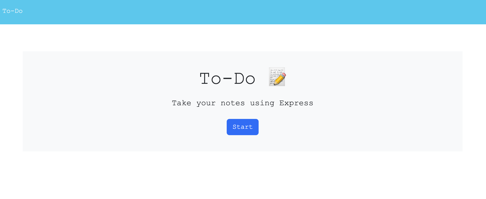
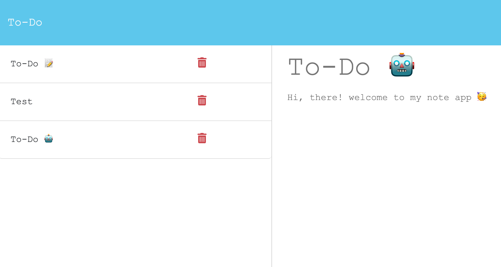

# To-do

This project is my note To-Do app and uses technologies like express.js, mongoose. It allows you to create, read, and delete notes.

## User Story

- AS A small business owner
- I WANT to be able to write and save notes
- SO THAT I can organize my thoughts and keep track of tasks I need to complete

## Acceptance Criteria

- GIVEN a note-taking application
- WHEN I open the Note Taker
- THEN I am presented with a landing page with a link to a notes page
- WHEN I click on the link to the notes page
- THEN I am presented with a page with existing notes listed in the left-hand column, plus empty fields to enter a new note title and the note’s text in the right-hand column
- WHEN I enter a new note title and the note’s text
- THEN a Save icon appears in the navigation at the top of the page
- WHEN I click on the Save icon
- THEN the new note I have entered is saved and appears in the left-hand column with the other existing notes
- WHEN I click on an existing note in the list in the left-hand column
- THEN that note appears in the right-hand column
- WHEN I click on the Write icon in the navigation at the top of the page
- THEN I am presented with empty fields to enter a new note title and the note’s text in the right-hand column

## Installation
To install the application, you will need to have Node.js and VS Code installed on your computer. 🧐 or go directly to the Heroku's URL.

- Clone this repository to your local machine.
- Open your terminal.
- Go to your project directory.
- Open VS Code.
- Run `npm install` to install all the dependencies.
- Run `npm run start`
- Open your browser and go to `http://localhost:3001`

## Usage

Once you are in port 3001, you will look the home page of the application with a list of your saved notes, if any exist. You can create a new note by clicking the 'New note' button in the top wight corner. ➕

When you create a new note, you will be prompted to enter a title and some text for the note. Once you have entered this information, click the save icon in the top right corner to save the note. 💾

To view a saved note just click on it in the list on the left side on the screen. To delete a note, click the trash icon to the note in the list 🗑️.

[GitHub/Jeacqueline To-Do](https://github.com/Jeacqueline/To-do)

[Heroku/ Jeacqueline todo]()

